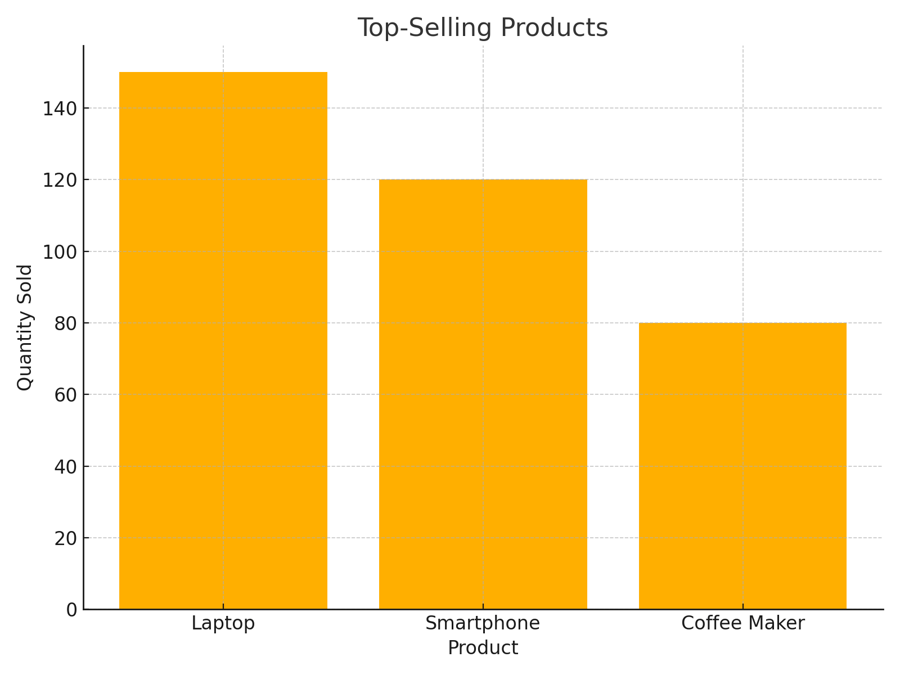
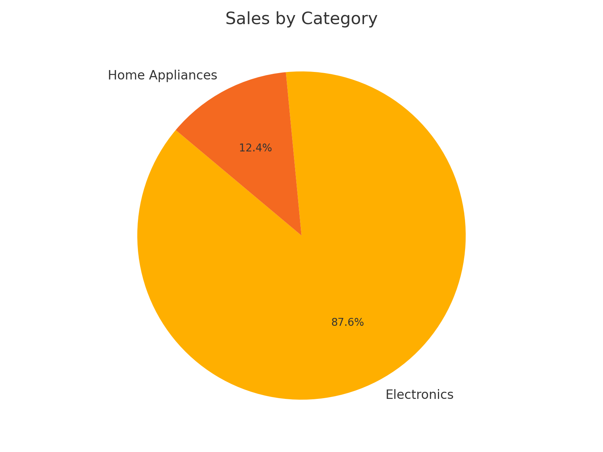
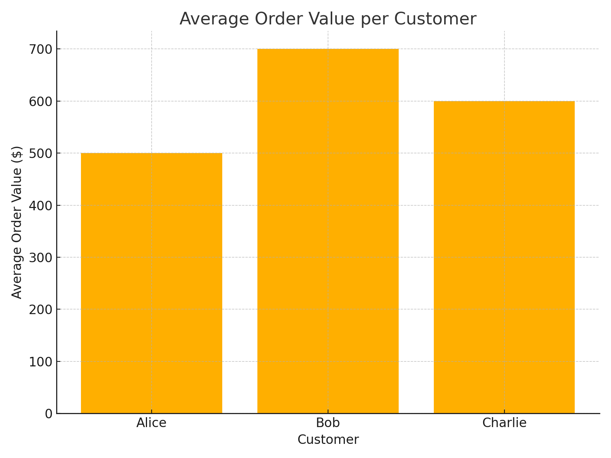
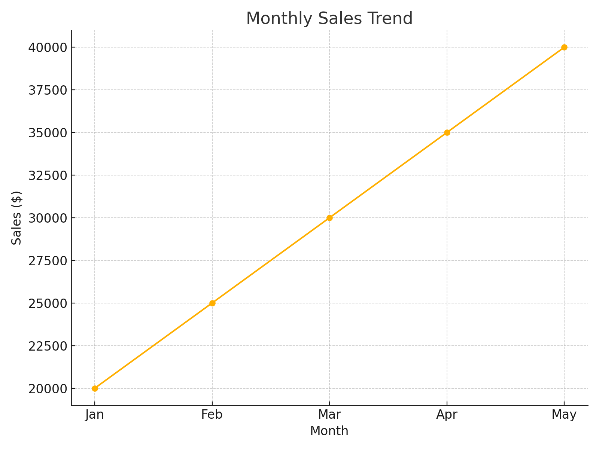
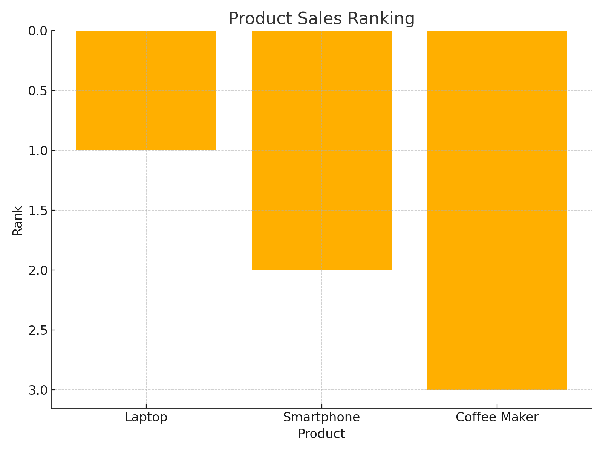

# Sales and Customer Analytics SQL Project

## Overview
This project analyzes sales and customer data for a fictional e-commerce company. The database includes tables for customers, products, orders, payments, and reviews. Various SQL queries are written to extract valuable insights from the data, such as top-selling products, customer spending, and product performance.

## Database Schema
The database includes the following tables:
- **Customers**: Information about customers (ID, name, age, gender, location).
- **Products**: Information about products (ID, name, category, price).
- **Orders**: Information about customer orders (order ID, customer ID, order date, total amount).
- **OrderDetails**: Details of the products in each order (order ID, product ID, quantity).
- **Payments**: Payment information (payment method, payment status).
- **Reviews**: Customer product reviews (rating, review text).

## SQL Queries
The project includes the following SQL queries:
1. **Top-selling products**: Identifies products with the highest sales.
2. **Sales by category**: Analyzes total sales by product category.
3. **Customer spending**: Computes the average order value for customers.
4. **Customer reviews**: Displays average ratings for each product.

## Getting Started
1. Clone this repository to your local machine:
   ```bash
   git clone https://github.com/your-username/sales-customer-analysis.git
   ```
2. Run the SQL scripts in your preferred SQL database (MySQL, PostgreSQL, etc.).
3. Execute the analysis queries to see the results.

## 🧠 Advanced SQL Techniques

This project also demonstrates advanced SQL concepts like window functions and common table expressions (CTEs). Below are a few examples:

### Running Total of Monthly Sales
```sql
SELECT
    DATE_TRUNC('month', order_date) AS month,
    SUM(total_amount) AS monthly_sales,
    SUM(SUM(total_amount)) OVER (ORDER BY DATE_TRUNC('month', order_date)) AS running_total
FROM Orders
GROUP BY month
ORDER BY month;
```

### High-Value Customers Using CTE
```sql
WITH CustomerSales AS (
    SELECT customer_id, SUM(total_amount) AS total_spent
    FROM Orders
    GROUP BY customer_id
)
SELECT c.name, cs.total_spent
FROM CustomerSales cs
JOIN Customers c ON c.customer_id = cs.customer_id
WHERE cs.total_spent > 1000;
```

### Product Ranking by Quantity Sold
```sql
SELECT
    p.name AS product_name,
    SUM(od.quantity) AS total_quantity,
    RANK() OVER (ORDER BY SUM(od.quantity) DESC) AS sales_rank
FROM OrderDetails od
JOIN Products p ON od.product_id = p.product_id
GROUP BY p.name;
```

### Repeat Customer Analysis
```sql
SELECT
    c.name,
    COUNT(o.order_id) AS total_orders,
    COUNT(o.order_id) OVER (PARTITION BY c.customer_id) AS orders_by_customer
FROM Orders o
JOIN Customers c ON o.customer_id = c.customer_id;
```


## Visuals

Below are sample visualizations generated from the analysis:

### Top-Selling Products


### Sales by Category


### Average Order Value per Customer


### Monthly Sales Trend


### Product Sales Ranking

